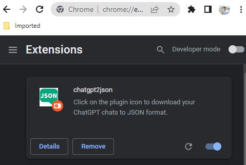

# README
The ChatGPT-to-JSON Downloader is a tool that converts ChatGPT conversations to JSON format. It streamlines the process of formatting ChatGPT conversations, making it easy to download, store and collaborate on the resulting JSON files. This tool is designed to simplify your workflow, making it perfect for developers, content creators and anyone looking to stay organized.

# Dev Preview
1. clone or download this repo
2. navigate to [chrome://extensions/](chrome://extensions/)
3. Toggle developer mode in the top right corner
4. load this extension by clicking 'Load Unpack'

